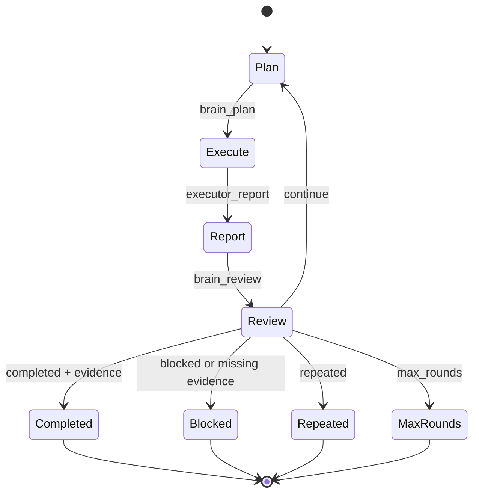
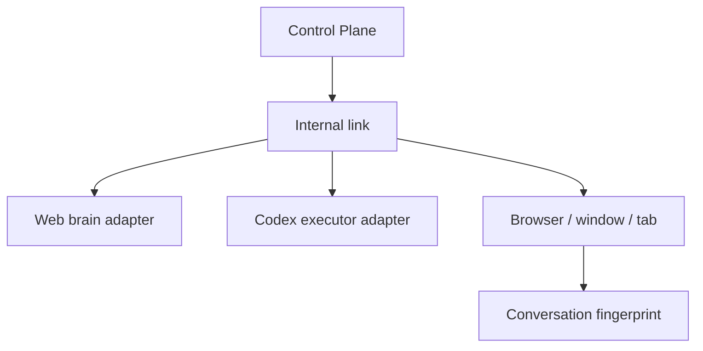

# 🧰 Codex Bridge Toolkit Series

> Talk only in Codex. The toolkit series connects visible web LLMs, monitors browser health, and reads local GitHub workspace context safely.

**Language: [中文（默认）](README.md) · English**


Codex ↔ Web LLM Conversation Bridge connects a Codex conversation to a visible ChatGPT Web, DeepSeek Web, or another supported web LLM. Users choose the provider, browser, window, tab, web conversation, and relay mode in natural language. The bridge handles browser discovery, routing, message envelopes, destination verification, and stop policies internally.

```text
ChatGPT Web / DeepSeek Web          Web brain
              │ visible reply
              ▼
     Codex ↔ Web LLM Bridge
              │ safe relay
              ▼
Codex / DeepSeek API                Local executor
              │
              ▼
       Workspace + tests + evidence
              └──────────────► Web brain
```

The bridge does not use the ChatGPT API, private web endpoints, cookie extraction, or password collection. The browser remains visible and the user completes login manually.

## Toolkit series

This repository is now an extensible local-first toolkit series, installed as one Codex plugin:

| Toolkit | Purpose |
| --- | --- |
| Web LLM Conversation Bridge | Connect ChatGPT/DeepSeek Web so the web brain plans/reviews and Codex executes locally |
| Browser Watchdog | Read-only checks for login, loading, generation, composer failure, or an unresponsive web session |
| GitHub Workspace | Read-only local Git/GitHub repository context for execution and review |

Useful natural-language requests include:

```text
List the toolkits in this plugin.
Show all Codex ↔ web links.
Check whether the ChatGPT tab is stuck.
Inspect the current GitHub workspace.
```

Each Codex conversation and web conversation can have an independent persisted link. Users see names, providers, web conversation titles, and status; `session_id`, `targetId`, and `route_id` stay internal. See [Toolkit series](docs/toolkit-series.md).

### Choose by intent

| Goal | Say this in Codex | Default side effect |
| --- | --- | --- |
| Let a web model plan/review a local task | `Connect to ChatGPT Web.` | Sends only after the bridge workflow is confirmed |
| Check whether a web session is stuck | `Check whether the ChatGPT tab is stuck.` | Read-only; no tab switch or resend |
| Monitor one web session periodically | `Start a browser watchdog named “paper ChatGPT” every 15 seconds.` | Monitors only the current MCP process |
| Inspect the current GitHub repository | `Inspect the current GitHub workspace.` | Read-only; no pull/push/commit |

Watchdogs must be started again after the MCP process restarts. They never pretend to have resumed and never silently continue a web session in the background.

## First use after installation

If you only want to connect Codex to ChatGPT Web or DeepSeek Web, follow these steps. Normal users do not need to understand `session_id`, `targetId`, `route_id`, MCP servers, or DevTools internals.

### 1. Install the plugin and create a new Codex conversation

Install `chatgpt-web-bridge` from the Codex plugin marketplace. After installing or updating:

1. Restart Codex.
2. Create a new Codex conversation.
3. Use the bridge from that new conversation.

Creating a new conversation matters because Codex may cache old plugin tools and skills. An existing conversation may not pick up the updated bridge immediately.

### 2. Prepare Edge automatically on the first connection

A normally launched Edge process cannot be taken over after the fact. Normal users do not need to manage a remote-debugging port or open PowerShell.

When you say “Connect to ChatGPT Web” or “Connect to DeepSeek Web” in Codex, the bridge automatically:

1. scans browsers that are already connectable;
2. starts an independent `CodexBridgeEdge` profile if none is available;
3. opens the selected ChatGPT or DeepSeek web page;
4. asks you to sign in manually in the visible window the first time;
5. reuses that window and login on later connections.

The dedicated Edge profile does not affect the Edge window you already use. Keep it open because the bridge can connect only to a running browser instance that exposes a debugging connection. Advanced users can set `auto_launch: false` and manage the browser themselves.

### 3. Open the bridge in Codex

In the new Codex conversation, say:

```text
Open the web bridge panel.
```

If your Codex version does not render the embedded panel, say:

```text
Open the web bridge panel in compatibility mode.
```

You can also skip the panel and say:

```text
Connect to ChatGPT Web.
```

The bridge scans available browsers and asks you to choose the web provider, browser, window, tab, and web conversation. Choose the visible name or number shown by Codex. Do not enter technical IDs.

### 4. Log in or recover a connection

If Codex reports that login is required:

1. Complete login manually in the dedicated Edge window.
2. Return to the same Codex conversation and say:

```text
I am logged in. Continue.
```

The bridge checks the login state, provider, tab, conversation, and composer again. It does not keep an MCP request open while waiting and never reads passwords, cookies, or tokens.

Once connected, the bridge pins the session to the same browser tab. Ordinary retries, health checks, or a temporary selector failure never create another tab; a new tab is allowed only for the initial connection or an explicit reconnection after the bound target is actually closed.

### 5. Choose a relay mode

After the connection becomes healthy, the plugin asks in the Codex conversation:

```text
What do you want Codex to accomplish? Describe one concrete goal.
```

After you answer, the plugin compiles the answer into a goal and attaches it to the current bridge task. The panel does not ask questions or create goals. The modes only choose how that goal collaborates with the web model:

| Goal | Say this in Codex |
| --- | --- |
| Ask the web model once | `Ask ChatGPT this question and return its opinion.` |
| Connect without sending | `Connect to DeepSeek Web, but do not send a message yet.` |
| Run a bounded task | `Use ChatGPT for planning and review for up to 10 rounds.` |
| Keep working until stopped | `Continue this goal until it is complete or blocked.` |

Example Brain-Hand workflow:

```text
Fix all failing tests in the current project and preserve test evidence.
Use ChatGPT Web for planning and review, Codex for execution, for up to 10 rounds.
```

The plugin uses the first sentence as the user's answer, creates the bridge goal, and attaches it to the task. The panel never asks you to enter a duplicate goal.

### 6. What you should see

After connecting, the two sides are shown separately:

```text
┌─────────────────────┐   ··· ↔ ···   ┌─────────────────────┐
│ Current Codex task  │  ──●──────▶  │ ChatGPT / DeepSeek  │
│ Current goal        │  ◀──●──────  │ Web reply           │
└─────────────────────┘               └─────────────────────┘
```

The left side is the current Codex task and the right side is the selected web conversation. The dashed line represents the binding; the connection marker represents the current connection state. If the web provider, tab, conversation, or login state changes, the bridge pauses instead of sending to an uncertain destination.

## Why use it?

| Without the bridge | With the bridge |
| --- | --- |
| A web model can plan but cannot safely operate on the local workspace. | The web model plans and reviews while Codex executes locally. |
| Codex executes locally, but every planning and review turn consumes the executor's context. | Planning, execution, evidence, and review form a controlled loop. |
| Multiple browser conversations are easy to mix up. | The bridge shows browser, window, tab, and conversation names and verifies the destination before every send. |

The core idea is:

> **Brain = the visible web LLM selected by the user**
>
> **Executor = the Codex App Server worker**

The default combination is ChatGPT Web → ChatGPT Luna. You can also choose DeepSeek Web, DeepSeek API Pro/Flash, or the current local Codex provider configuration. Technical route and session identifiers remain internal.

## How it works

```text
1. The plugin creates a goal from the user's answer after connection.
2. The web brain proposes one concrete next task.
3. Codex executes it in the connected workspace.
4. The bridge sends changes, tests, blockers, and evidence back to the web brain.
5. The web brain reviews the execution result.
6. The loop continues, completes, blocks, or stops after repetition.
```

### Five-minute quick start

After installing the plugin, create a new Codex conversation and say:

```text
Connect to ChatGPT Web.
```

The bridge scans connectable browsers and shows readable choices such as:

```text
Found 2 connectable browsers:

① Edge browser 1 · 2 windows · 8 tabs
② Edge browser 2 · 1 window · 3 tabs
```

Choose the tab and web conversation by name or position. For a one-time question:

```text
Ask ChatGPT to review the current architecture and point out disagreements.
```

For a Brain-Hand loop:

```text
Connect to ChatGPT and use 10 relay rounds.
Goal: fix all failing tests in the current project until the web reviewer approves.
```

The bridge handles browser selection, conversation binding, planning, execution, reporting, review, evidence checks, and safe stopping. Users do not need to enter `session_id`, `target_id`, `route_id`, or a DevTools port.

## How the control panel works

The plugin includes a status-only two-column panel for hosts that support MCP UI resources. It is a compatible rendering of the intended Codex ↔ Web layout; it is not an undocumented injection into the official Codex Desktop renderer.

Say:

```text
Open the web bridge panel.
```

The `bridge_panel` tool renders the panel inside the current Codex conversation when the host supports UI resources. The host conversation is the binding boundary: a panel rendered in Codex conversation A belongs to A, and a panel rendered in conversation B belongs to B. Codex is shown on the left and the selected web conversation on the right, joined by a dashed link and a connection marker.

When the MCP host provides the current Codex conversation context in request metadata, the bridge binds that visible conversation to the route and shows `Current Codex conversation`. When the host does not provide it, the bridge explicitly shows `Plugin-managed Codex Worker` instead of guessing a thread ID. The panel only visualizes connection state and destination; messages, questions, goals, and controls remain in the Codex conversation.

### Native Codex Goal synchronization

After the web connection is ready, Codex asks the user for the task objective. `bridge_goal_create` persists the Bridge Goal; in bounded or continuous mode it also creates or resumes the internal Codex Worker and writes the native Goal through the official App Server `thread/goal/set` method. The result includes `native_goal.synced`; only `true` means the native Goal was written successfully.

“Native Goal” normally means the Goal on the Codex Worker thread managed by the plugin. If the MCP host provides and the bridge verifies the current visible Codex thread, the route resumes and binds that conversation instead. Without host context, the plugin does not guess or mutate another Desktop task. One-shot mode does not start a Worker just to send one message; `bridge_run` retries synchronization when it starts the Worker later. See [the native integration boundary](docs/codex-native-integration.md).

If the host does not render MCP UI resources, use compatibility mode. It opens the legacy loopback panel on `127.0.0.1` with a random per-launch token. A truly native Desktop panel requires a Codex host extension point or a maintained Codex fork; see [the native integration boundary](docs/codex-native-integration.md).

## Connection modes

| Mode | User wording | Behavior |
| --- | --- | --- |
| One-shot | “Ask ChatGPT” | Send once, receive the visible reply, then stop |
| Manual link | “Connect, but do not send automatically” | Establish a link and wait for the next instruction |
| Bounded rounds | “Use 10 rounds” | Run 1–50 controlled relay rounds |
| Continuous | “Continue the current Codex goal” | Continue until completion, blocking, repetition, goal change, or user stop |

`0` rounds means a manual link, not an infinite loop. The plugin creates the goal by asking the user after connection; the relay mode only chooses how that goal collaborates with the web model. Bounded and continuous modes apply internal safety limits.

## Browser → window → tab → conversation

One browser instance can host multiple windows and tabs. The bridge presents this hierarchy in human terms and keeps technical target identities private:

```text
Edge browser 1
├── Window 1
│   ├── ① GitHub
│   ├── ② ChatGPT
│   └── ③ DeepSeek
└── Window 2
    └── ① ChatGPT
```

A web tab and a conversation are separate bindings: a user can switch conversations inside the same ChatGPT tab. Before every send, the bridge verifies the provider domain, browser tab, and conversation fingerprint. If the user switches to another conversation, the connection pauses instead of sending to the wrong destination.

## Brain/executor combinations

The web brain and Codex executor are independent choices:

| Web brain | Codex executor | Use case |
| --- | --- | --- |
| ChatGPT Web | ChatGPT Luna | Default, general-purpose planning and execution |
| DeepSeek Web | ChatGPT Luna | Chinese planning with the Luna executor |
| ChatGPT Web | DeepSeek API Pro | Stronger DeepSeek execution/reasoning |
| ChatGPT Web | DeepSeek API Flash | Lower-cost, lower-latency execution |
| DeepSeek Web | DeepSeek API Pro/Flash | DeepSeek planning and execution |
| ChatGPT/DeepSeek Web | `codex_current` | Follow the user's existing local Codex provider/model |

Use `executor_provider_list` to inspect available executor choices. DeepSeek documents its OpenAI-compatible API and Pro/Flash model names in the [official API documentation](https://api-docs.deepseek.com/api/list-models).

## Brain-Hand loop



`continue_task` and the runtime runner enforce:

- 20 default rounds and 50 maximum for bounded runs
- an evidence gate before completion
- repeated-result detection
- blocked-state detection
- an explicit stop on Codex approval or interaction requests

## Control Plane and adapters



The Control Plane stores routing metadata and recent structured events, not a centralized transcript warehouse. ChatGPT Web and DeepSeek Web are separate provider adapters. The user-facing layer uses names and positions; internal route/session identifiers are implementation details. Actions for one link are serialized while separate links can progress independently.

## Security model

### Included

- Visible Chrome or Edge automation
- Manual user login
- Localhost Chrome DevTools Protocol
- A dedicated browser profile recommendation
- Human-readable browser/window/tab/conversation selection
- Destination verification before every send
- Message origin, relay, and deduplication metadata
- Bounded reports instead of hidden reasoning

### Not included

- Password collection
- Cookie or session-token extraction
- CAPTCHA or access-control bypass
- Private ChatGPT endpoints
- Hidden conversation-history scraping
- Hidden chain-of-thought extraction
- Silent approval of Codex commands

## What this is not

This project is not:

- a ChatGPT API wrapper
- a reverse-engineered private API client
- a cookie/session-token scraper
- an unrestricted autonomous computer agent
- a centralized conversation-history server

## Troubleshooting

### Edge is not found

The usual cause is that the current Edge was launched normally and does not expose a debugging connection. Normal users do not need to repair this manually; say the following in the same Codex conversation:

```text
Start the dedicated browser and open ChatGPT Web.
```

The bridge starts and scans the dedicated `CodexBridgeEdge` profile automatically. Sign in in the new visible window the first time, and keep it separate from your ordinary Edge window.

### Multiple browsers or tabs are listed

This is expected. The bridge does not guess a destination. Choose the browser name, window number, and tab title returned by Codex.

### The web page is logged in, but the bridge asks for login

Make sure you logged in to the dedicated Edge profile that the bridge discovered, not another ordinary Edge window. After logging in, return to the same Codex conversation and say:

```text
I am logged in. Continue.
```

If the composer or send button is temporarily unavailable, the bridge reloads the original tab once and checks it again. It continues if recovery succeeds; otherwise it preserves the tab and pauses instead of reopening the page. Reconnect explicitly only after confirming that the target was actually closed.

### The panel does not appear

Create a new Codex conversation and ask for the panel again. If it still does not appear, use compatibility mode. Compatibility mode opens a local loopback panel and does not replace manual web login.

### Codex does not use the updated plugin

Restart Codex after installation or update, then test in a new conversation. The recommended first command is:

```text
Open the web bridge panel.
```

If your Codex version supports plugin mentions, you can be explicit:

```text
@chatgpt-web-bridge Open the web bridge panel.
```

### The web model or conversation is wrong

Say:

```text
Pause the web connection.
```

The bridge automatically pauses when the browser, tab, provider, conversation, or login state changes. Correct the visible browser page, then explicitly ask to resume. It will not guess a new conversation.

### Why do I see `dashi-taskboard`?

`dashi-taskboard` is not a dependency of this plugin and is not bundled into this repository. It is a separate public project. If your ordinary Edge window already has that GitHub page open, browser discovery can see the tab or window. Before sending anything, the bridge still verifies the web-model domain and conversation destination, so it will not treat a GitHub page as a ChatGPT or DeepSeek conversation. Choose the correct web-LLM tab.

## Tool reference

Most users only need natural-language requests in the Codex conversation.

### Toolkit series tools

- `bridge_toolkit_list`
- `bridge_toolkit_status`
- `bridge_link_list`
- `browser_watchdog_scan`
- `browser_watchdog_start`
- `browser_watchdog_status`
- `browser_watchdog_stop`
- `github_workspace_status`

### End-user bridge tools

- `bridge_panel`
- `bridge_discover`
- `bridge_connect`
- `bridge_goal_create`
- `bridge_status`
- `bridge_focus`
- `bridge_send`
- `bridge_receive`
- `bridge_run`
- `bridge_pause`
- `bridge_disconnect`

### Brain-Hand tools

- `brain_plan`
- `executor_report`
- `brain_review`
- `continue_task`
- `run_round`
- `run_until_stop`
- `brain_status`
- `brain_reset`

### Control Plane and Codex worker tools

- `bridge_route_create`
- `bridge_route_bind`
- `bridge_route_list`
- `bridge_route_status`
- `bridge_route_pause`
- `bridge_route_resume`
- `bridge_route_event`
- `executor_provider_list`
- `codex_adapter_status`
- `codex_thread_start`
- `codex_thread_turn`
- `codex_thread_read`

Lower-level browser tools remain available for diagnostics and adapter development, but they are not part of the normal user workflow. The public bridge resolves human browser names, window labels, tab positions/titles, and conversation titles into internal identities.

## Limitations

- Requires a visible, manually signed-in web-brain session.
- A normal browser process without a debugging connection cannot be attached after the fact.
- Depends on the current visible ChatGPT Web or DeepSeek Web UI and its selectors.
- Does not bypass login, CAPTCHA, rate limits, or access controls.
- Windows cannot attach the bridge to an arbitrary existing desktop Codex window. `codex_current` inherits the user's local Codex configuration; worker identity remains internal unless a developer uses the low-level adapter API.
- The Control Plane stores routing metadata and recent structured events, not a full transcript warehouse.
- Cross-process route locking depends on Node's `node:sqlite` capability.
- A Codex approval or interaction request stops the loop instead of being auto-approved.

## Development

Normal users do not need these commands. Contributors working from a clone can run:

```powershell
npm test
npm run check
```

The plugin manifest is `.codex-plugin/plugin.json`, the MCP server definition is `.mcp.json`, and the MCP entrypoint is `scripts/mcp_server.mjs`.

For a privacy-safe demo recording, use the [demo recording script](docs/demo-script.md). The repository does not include placeholder GIFs or recordings containing login accounts.
