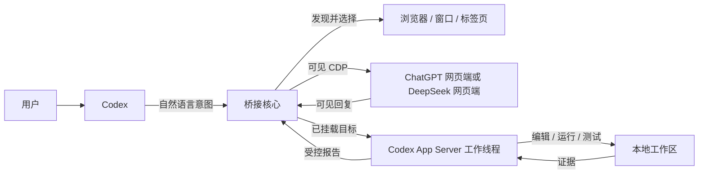
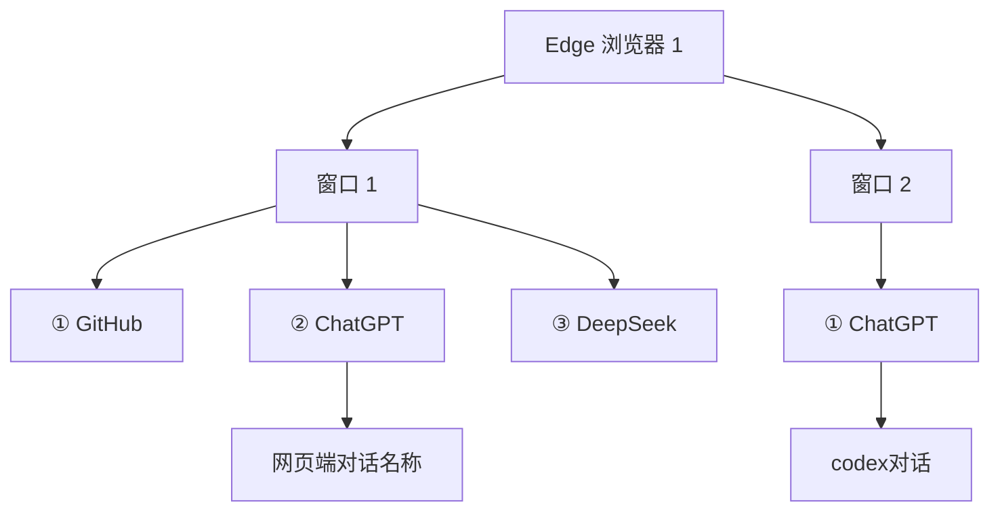
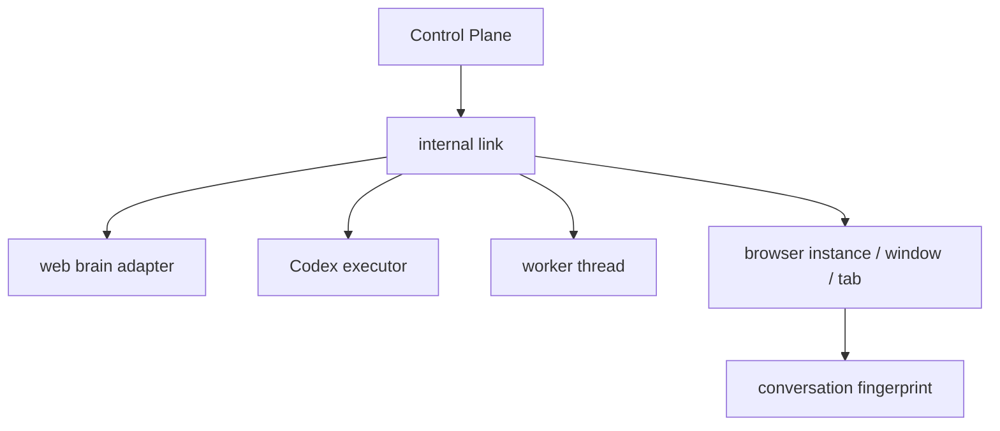
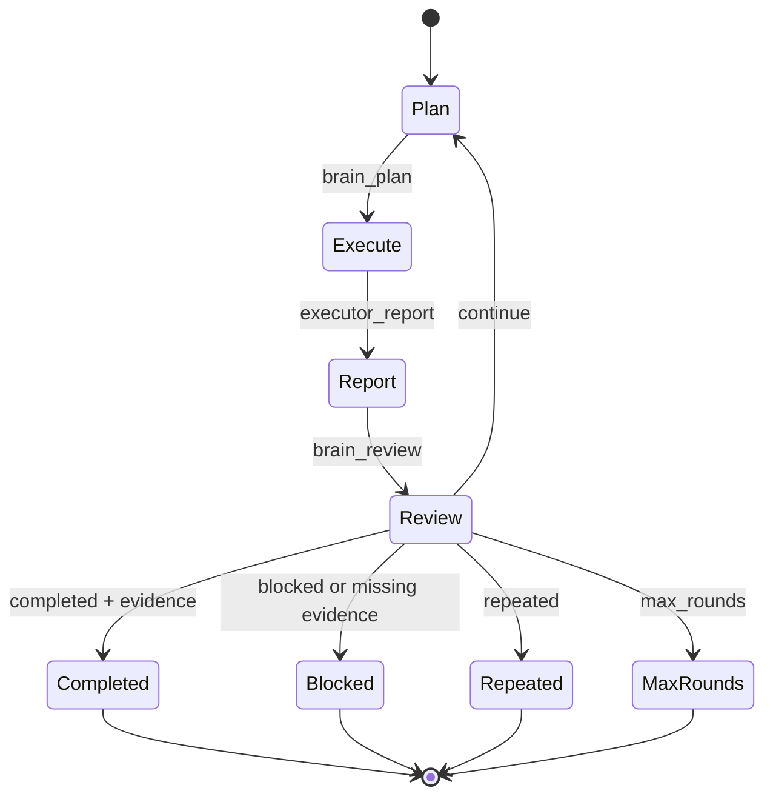

# 🧰 Codex Bridge Toolkit Series

> 只在 Codex 里说话；插件系列负责连接网页大模型、检查浏览器和读取本地 GitHub 工作区。

**语言：中文（默认） · [English](README.en.md)**


Codex ↔ 网页大模型对话桥接，可以把一个 Codex 对话连接到可见的 ChatGPT 网页端、DeepSeek 网页端或其他受支持的网页大模型。用户只需用自然语言选择模型、浏览器、标签页、网页对话和连接模式；插件会在内部处理浏览器发现、路由、消息封装、目标校验和停止策略。

```text
ChatGPT 网页端 / DeepSeek 网页端     网页大脑
              │ 可见回复
              ▼
    Codex ↔ 网页大模型桥接
              │ 安全转发
              ▼
Codex / DeepSeek API             本地执行手
              │
              ▼
       工作区 + 测试 + 证据
              └──────────────► 网页大脑
```

不使用 ChatGPT API，不访问私有网页接口，不提取 Cookie 或密码。浏览器始终可见，用户自行完成登录。

## 插件系列工具包

这个仓库现在是一个可扩展的本地优先工具包系列，默认安装一次即可使用：

| 工具包 | 用途 |
| --- | --- |
| Web LLM Conversation Bridge | 连接 ChatGPT/DeepSeek 网页端，让网页大脑规划审查、Codex 在本地执行 |
| Browser Watchdog | 只读检查多个网页会话是否登录、加载、生成或卡死 |
| GitHub Workspace | 只读读取当前本地 Git/GitHub 仓库状态，作为执行和审查上下文 |

常用说法：

```text
列出这个插件的工具包
查看所有 Codex 和网页端连接
检查 ChatGPT 标签页是否卡住
检查当前 GitHub 工作区
```

每个 Codex 对话和网页对话的连接会独立保存；用户只看连接名称、模型、网页对话标题和状态，不需要管理 `session_id`、`targetId` 或 `route_id`。完整说明见 [插件系列工具包](docs/toolkit-series.md)。

### 按需求选择工具包

| 你的目的 | 在 Codex 中说 | 默认副作用 |
| --- | --- | --- |
| 让网页模型规划、审查本地任务 | `连接 ChatGPT 网页端` | 只在用户确认后发送网页消息 |
| 检查网页会话是否卡住 | `检查 ChatGPT 标签页是否卡住` | 只读，不切换标签页、不重发消息 |
| 持续监控一个网页会话 | `启动“论文 ChatGPT”浏览器守护，每 15 秒检查一次` | 只在当前 MCP 进程监控 |
| 查看当前 GitHub 仓库 | `检查当前 GitHub 工作区` | 只读，不 pull/push/commit |

浏览器守护在 MCP 进程重启后需要重新启动；它不会伪装成已经恢复，也不会后台自动续接网页会话。

## 安装后第一次使用

如果你只是想把 Codex 和 ChatGPT/DeepSeek 网页端连接起来，按下面顺序操作即可。普通用户不需要了解 `session_id`、`targetId`、`route_id`、MCP Server 或 DevTools。

### 1. 安装插件并新建 Codex 对话

从 Codex 的插件市场安装 `chatgpt-web-bridge`。安装或更新完成后：

1. 重启 Codex；
2. 新建一个 Codex 对话；
3. 在这个新对话中使用桥接功能。

新建对话很重要：Codex 可能会缓存旧的插件工具和技能，旧对话不一定马上看到更新后的桥接能力。

### 2. 第一次连接时自动准备 Edge

普通启动的 Edge 不能被插件事后接管，但普通用户不需要自己处理远程调试端口，也不需要打开 PowerShell。

当你在 Codex 中说“连接 ChatGPT 网页端”或“连接 DeepSeek 网页端”时，插件会按下面的顺序自动处理：

1. 先扫描已经可以连接的浏览器；
2. 如果没有可连接的浏览器，自动启动一个独立的 `CodexBridgeEdge` 配置；
3. 自动打开你选择的 ChatGPT 或 DeepSeek 网页端；
4. 第一次请在这个可见窗口中手动登录；
5. 以后复用这个窗口，不需要重复登录。

这个独立 Edge 不会影响你原来正在使用的 Edge。不要关闭它；插件只能连接仍然打开且带有调试连接的浏览器实例。高级用户仍可通过 `auto_launch: false` 关闭自动启动并自行管理浏览器。

### 3. 在 Codex 中打开桥接

在新建的 Codex 对话中说：

```text
打开网页桥接面板
```

如果当前 Codex 版本不显示内嵌面板，改说：

```text
使用兼容模式打开网页桥接面板
```

也可以完全不用面板，直接说：

```text
连接 ChatGPT 网页端
```

插件会扫描浏览器，然后让你选择：网页模型、浏览器、窗口、标签页和网页对话。只选择你能在屏幕上看到的名称或编号，不要输入任何技术 ID。

### 4. 登录或恢复连接

如果 Codex 返回“需要登录”：

1. 在专用 Edge 窗口手动完成登录；
2. 回到 Codex 说：

```text
登录好了，继续
```

插件会重新检查登录状态、网页模型、标签页和网页对话。它不会等待几分钟，也不会读取密码、Cookie 或 Token。

连接建立后会固定使用选定的同一个标签页。普通发送重试、健康检查或页面选择器暂时失效，都不会自动新建标签页；只有首次没有绑定标签页，或用户明确重新连接一个已经关闭的目标，才允许创建新的标签页。

### 5. 选择使用方式

连接成功后，插件会先在 Codex 对话中问你：

```text
你希望 Codex 完成什么？请描述一个具体目标。
```

你回答后，插件会自动把回答整理成目标并挂到本次桥接任务。面板不提问，也不创建目标。这些模式只决定目标如何和网页端协作：

| 你想做什么 | 在 Codex 中这样说 |
| --- | --- |
| 只问网页模型一次 | `把这个问题问一下 ChatGPT，只返回网页端的意见。` |
| 先连接，不自动发送 | `先连接 DeepSeek 网页端，但不要发送消息。` |
| 当前目标进行指定轮次 | `使用 ChatGPT 规划和审查，往返 10 轮。` |
| 当前目标持续执行 | `持续执行这个目标，直到完成或阻塞。` |

例如，完整的 Brain-Hand 用法是：

```text
请修复当前项目中所有 failing tests，并保留测试证据。
使用 ChatGPT 网页端做规划和审查，Codex 负责执行，最多往返 10 轮。
```

插件会把第一句作为用户回答，创建并挂载本次桥接目标；面板不会要求你重复填写“执行目标”。

### 6. 你应该看到什么

连接成功后，界面会把两端分开显示：

```text
┌─────────────────────┐   ··· ↔ ···   ┌─────────────────────┐
│ Codex 当前对话       │  ──●──────▶  │ ChatGPT / DeepSeek  │
│ 当前任务目标         │  ◀──●──────  │ 网页端回复          │
└─────────────────────┘               └─────────────────────┘
```

左边是当前 Codex 任务，右边是你选定的网页对话。虚线表示目标绑定，连接点表示当前连接状态。网页模型更换标签页、对话或登录状态后，插件会暂停，不会把消息发错地方。

## 为什么需要它？

| 没有桥接 | 使用桥接后 |
| --- | --- |
| 网页模型可以规划，但不能安全操作本地工作区。 | 网页模型负责规划和审查，Codex 负责本地执行。 |
| Codex 可以本地执行，但每一轮规划和审查都会占用执行模型。 | 规划、执行、证据和审查变成受控的闭环。 |
| 多个浏览器对话很容易弄混。 | 桥接会显示浏览器名称、窗口编号、标签页位置和对话标题，并在每次发送前校验目标。 |

核心思想很简单：

> **大脑 = 用户选定的可见网页大模型**
>
> **执行手 = Codex App Server 工作线程**

默认组合是 ChatGPT 网页端 → ChatGPT Luna。也可以选择 DeepSeek 网页端、DeepSeek API Pro/Flash，或当前本地 Codex 配置。技术路由和会话标识始终隐藏在内部。

## 工作方式

```text
1. ChatGPT 网页端提出一个具体的下一步任务
2. Codex 在连接的工作区中执行
3. 桥接把变更、测试、阻塞和证据发回网页端
4. ChatGPT 审查执行结果
5. 循环继续、完成、阻塞，或因重复而停止
```

### 五分钟快速体验

安装插件后，新建一个 Codex 对话并说：

```text
连接 ChatGPT 网页端。
```

插件会扫描可连接的浏览器，并显示类似下面的可读选项：

```text
发现 2 个可连接的浏览器：

① Edge 浏览器 1 · 2 个窗口 · 8 个标签页
② Edge 浏览器 2 · 1 个窗口 · 3 个标签页
```

然后按名称或位置选择标签页和网页对话。只问一次时可以说：

```text
把当前架构问一下 ChatGPT，看它有没有不同意见。
```

使用大脑-执行手模式时可以说：

```text
连接 ChatGPT，使用 10 轮往返。
目标：修复当前项目所有 failing tests，直到网页端审查通过。
```

桥接会处理浏览器选择、对话绑定、规划/执行/报告/审查回合、证据检查和安全停止。用户不需要输入 `session_id`、`target_id`、`route_id` 或 DevTools 端口。

如果要录制隐私安全的演示视频，请使用[演示录制脚本](docs/demo-script.md)。仓库不会放入占位 GIF，也不会放入包含登录账号的录屏。

## 工作原理



桥接在用户侧以对话为核心，在内部以元数据为核心。它只转发明确消息和受控证据，不是集中式的完整对话记录服务器。

### 用户可用的连接模式

| 模式 | 用户说法 | 行为 |
| --- | --- | --- |
| 单次询问 | “问一下 ChatGPT” | 发送一次，接收可见回复，然后结束 |
| 手动联机 | “先连上，但不要自动发送” | 建立连接，等待下一条用户指令 |
| 指定轮次 | “往返 10 轮” | 执行 1–50 轮受控往返 |
| 持续连接 | “持续执行这个目标” | 围绕连接后由用户回答创建的目标继续执行，直到完成、阻塞、重复、目标变化或用户停止 |

`0` 轮表示手动联机，不是无限循环。目标由插件在连接成功后向用户提问并创建，连接模式只决定这个目标的协作方式；指定轮次和持续连接通过内部安全上限防止循环失控。

## Quick start

### Prerequisites

- Codex Desktop or CLI with plugin support
- Node.js available to Codex（从插件市场安装时通常由 Codex 自动处理）
- Chrome or Edge that can expose a visible debugging connection
- A ChatGPT Web or DeepSeek Web account
- A local Codex configuration/profile if using DeepSeek API

For full cross-process route leases, use a Node runtime that provides `node:sqlite`. Without it, the bridge remains usable and reports process-only serialization.

### Install

普通用户只需要从 Codex 插件市场安装 `chatgpt-web-bridge`；不需要手动运行 `scripts/mcp_server.mjs`、打开 PowerShell 或配置 DevTools 端口。插件安装后，Codex 会按 `.mcp.json` 自动启动桥接服务；第一次连接网页端时，桥接服务会自动启动独立的 Edge 配置。

只有在本地开发或从 GitHub 克隆仓库时，才需要验证：

```powershell
npm test
npm run check
```

The MCP server entrypoint is `scripts/mcp_server.mjs`; the repository's `.mcp.json` contains the local server definition.

### Open the control panel

The plugin includes a status-only two-column panel for hosts that support MCP UI resources. It is a compatible rendering of the intended Codex ↔ Web layout; it is not an undocumented injection into the official Codex Desktop renderer. In Codex, say:

```text
打开网页桥接面板
```

The `bridge_panel` tool renders the panel inside the current Codex conversation when the host supports UI resources. The host conversation is the binding boundary: a panel rendered in Codex conversation A belongs to A, and a panel rendered in conversation B belongs to B. The UI is arranged as two status columns: Codex on the left and the selected web conversation on the right, joined by a dashed link and a connection marker.

如果 MCP 宿主在请求元数据中提供当前 Codex conversation context，插件会把当前可见对话绑定到该 route，并在面板显示“当前 Codex 对话”；如果宿主没有提供，插件会明确显示“插件托管的 Codex Worker”，不会猜测 thread ID。面板只可视化连接状态和目标，不显示消息、不提问、不创建目标；这些动作仍然在 Codex 对话中完成。

### Codex 原生 Goal 同步

连接成功后，Codex 会在对话中询问本次任务目标。调用 `bridge_goal_create` 后，插件会保存 Bridge Goal；在指定轮次或持续模式下，它还会自动创建/恢复内部 Codex Worker，并通过官方 App Server 的 `thread/goal/set` 写入原生 Goal。`bridge_goal_create` 的返回结果包含 `native_goal.synced`，只有这个字段为 `true` 才表示原生 Goal 已成功写入。

这里的“原生 Goal”默认指插件管理的 Codex Worker thread；如果 MCP 宿主提供并验证了当前可见 Codex thread，则会绑定并恢复当前对话。没有宿主上下文时，插件不会猜测或修改另一个 Desktop 对话的隐藏 Goal。单次模式不会为了发一次消息额外启动 Worker；后续 `bridge_run` 启动 Worker 时会自动重试同步。详见 [Codex 原生集成边界](docs/codex-native-integration.md)。

If the current Codex host does not render MCP UI resources yet, use `bridge_panel` with `external: true` to open the legacy loopback panel. That fallback talks only to `127.0.0.1` through a random per-launch token and does not replace the visible login flow. A truly native Desktop panel requires a Codex host extension point or a maintained Codex Fork; see [the native integration boundary](docs/codex-native-integration.md).

### Connect a web brain

The normal user flow is entirely inside a new Codex conversation:

```text
连接网页端。
```

The bridge scans available debugging endpoints, groups them as browser instances, lists windows and tabs in human terms, and asks the user to choose when there is more than one candidate. It then asks for the web provider and visible conversation if they are not unambiguous.

If the selected page needs login, the bridge returns a `WAITING_FOR_LOGIN` state instead of holding an MCP request open. Sign in manually in the visible browser, then say:

```text
登录好了，继续。
```

The bridge re-checks login state, composer availability, provider domain, tab identity, and conversation fingerprint before sending anything.

If the user already has a normal Edge window open, it may remain open. A browser instance must expose a debugging connection before the bridge can attach to its rendered pages. If the existing profile does not expose one, the bridge automatically starts its dedicated persistent profile and reuses that profile's login. The bridge never reads cookies or passwords.

### Select an executor

```json
{
  "executor_provider": "chatgpt_luna"
}
```

```json
{
  "executor_provider": "deepseek_api",
  "executor_model": "deepseek-v4-flash"
}
```

For users whose local Codex configuration already uses DeepSeek API, inherit it instead of forcing a bridge profile:

```json
{
  "executor_provider": "codex_current",
  "executor_model": "deepseek-v4-flash",
  "executor_profile": "optional-custom-profile"
}
```

`executor_profile` is only a local profile name. The bridge never reads, stores, or forwards the profile's API key.

## Brain/executor combinations

The web brain and Codex executor are independent choices:

| Web brain | Codex executor | Use case |
| --- | --- | --- |
| ChatGPT Web | ChatGPT Luna | Default, general-purpose planning and execution |
| DeepSeek Web | ChatGPT Luna | Chinese planning with the Luna executor |
| ChatGPT Web | DeepSeek API Pro | Stronger DeepSeek execution/reasoning |
| ChatGPT Web | DeepSeek API Flash | Lower-cost, lower-latency execution |
| DeepSeek Web | DeepSeek API Pro/Flash | DeepSeek planning and execution |
| ChatGPT/DeepSeek Web | `codex_current` | Follow the user's existing local Codex provider/model |

Use `executor_provider_list` to inspect the available executor choices. DeepSeek documents the OpenAI-compatible API and the Pro/Flash model names in its [official API documentation](https://api-docs.deepseek.com/api/list-models).

## Browser → window → tab → conversation

One browser instance can host multiple windows and tabs. The bridge presents this hierarchy to the user and keeps the technical target identity private:



The tab and conversation are separate bindings: a user can switch conversations inside the same ChatGPT tab. Before every send, the bridge verifies the provider domain, browser tab, and conversation fingerprint. If the user manually switches to a different conversation, the connection pauses instead of sending to the wrong destination.

## 常见问题

### 扫描不到 Edge

通常是因为当前 Edge 是普通启动的，没有网页调试连接。普通用户不需要手动修复，直接在同一个 Codex 对话中说：

```text
启动专用浏览器并打开 ChatGPT 网页端
```

插件会自动启动并扫描专用 `CodexBridgeEdge` 配置。第一次使用时在新窗口登录，之后不要把普通 Edge 的窗口和专用 Edge 混在一起判断。

### 扫描到多个浏览器或多个标签页

这是正常的安全行为。插件不会猜测目标。按 Codex 返回的浏览器名称、窗口编号和标签页标题选择，例如：

```text
选择 Edge 浏览器 1，窗口 1，ChatGPT 标签页，网页对话“A”。
```

### 网页端已经登录，但插件仍然说需要登录

确认登录的是插件扫描到的那个专用 Edge 窗口，而不是另一个普通 Edge 窗口。登录完成后回到同一个 Codex 对话，说：

```text
登录好了，继续
```

不要重复点击发送，也不要在等待网页回复时刷新或切换网页对话。

如果输入框或发送按钮暂时找不到，插件会在原标签页刷新一次并重新检查；恢复成功就继续，失败则保留原标签页并暂停，不会为了“恢复”而重复打开网页。确认页面确实关闭后，再显式重新连接。

### 面板没有显示

先新建 Codex 对话并重新说“打开网页桥接面板”。如果仍然没有内嵌面板，说“使用兼容模式打开网页桥接面板”。兼容模式会打开本机回环地址的可视面板；它不公开到互联网，也不会替代网页端的手动登录。

### 更新插件后 Codex 还是不会用

安装或更新后必须重启 Codex，并在新对话中测试。推荐第一句直接使用：

```text
打开网页桥接面板
```

如果 Codex 只把这句话当普通聊天，而没有调用插件，请确认插件已启用，然后新建对话；不要在旧对话里反复输入相同命令。

如果你的 Codex 版本支持插件 @ 提及，也可以明确写成：

```text
@chatgpt-web-bridge 打开网页桥接面板
```

### 网页模型切错了怎么办

立即说：

```text
暂停网页连接
```

插件会在目标浏览器、标签页、提供商或网页对话发生变化时自动暂停。修正网页标签页后，再明确说“恢复连接”；插件不会自动猜测新的网页对话。

### 为什么会看到 `dashi-taskboard`？

`dashi-taskboard` 不是本插件的依赖，也没有被内置到本仓库。它是另一个独立的公开项目；如果你的普通 Edge 当前打开了它，浏览器扫描会看到这个标签页或窗口。桥接真正发送消息前仍会校验网页模型域名和对话目标，不会把 GitHub 页面当成 ChatGPT/DeepSeek 对话。选择正确的网页端标签页即可。

## Control Plane



Control Plane stores routing metadata and recent structured events, not centralized conversation history. The user-facing layer names the link; internal route/session identifiers are implementation details. Actions for one link are serialized; separate links can progress independently.

## Two link protocols

### Chat Link

The two sides exchange visible messages as peers:

```text
Codex ↔ Web LLM
```

Use this for questions, critique, brainstorming, and one-time or manually triggered discussion.

### Brain-Hand Link

The web model plans and reviews while Codex executes locally:

```text
Plan → Execute → Evidence → Review → Next task
```

Web replies are marked as peer-agent messages. They do not become user authorization merely because they arrived through the browser.

## Brain-hand loop



`continue_task` and the Runtime Runner enforce:

- 20 default rounds, 50 maximum
- completion evidence gate
- repeated-result detection
- blocked-state detection
- explicit stop on Codex approval or interaction requests

## Capabilities

| Capability | What it does |
| --- | --- |
| Brain planning | The selected web AI produces one concrete next task |
| Local execution | Codex edits files, runs tools, and tests the workspace |
| Evidence loop | Changes, tests, blockers, and evidence return to the web brain |
| Review | Classifies the result as continue, completed, blocked, or repeated |
| Multi-tab | Keeps independent browser brains isolated per task |
| Browser discovery | Scans available connections and presents browser/window/tab choices |
| Conversation binding | Separates a web tab from the conversation currently open inside it |
| Persistent links | Recovers the selected browser/tab/conversation binding internally |
| Control Plane | Maps Codex workers to web-brain links without exposing routing IDs |
| Bounded autonomy | Runs 1–50 controlled rounds |
| Manual link | Uses 0 rounds to connect without automatically sending |
| Continuous goal | Runs until the goal reaches a terminal state or a safety stop; the default internal safety limit is 1,000 rounds |
| Evidence gate | Requires structured evidence before completion |
| Visible browser | Uses rendered pages and localhost CDP only |

## Security model

### Included

- ✅ Visible Chrome or Edge automation
- ✅ Manual user login
- ✅ Localhost Chrome DevTools Protocol
- ✅ Dedicated browser profile recommended
- ✅ Human-readable browser/window/tab/conversation selection
- ✅ Destination verification before every send
- ✅ Message origin, relay, and deduplication metadata
- ✅ Bounded reports instead of hidden reasoning

### Not included

- ❌ Password collection
- ❌ Cookie or session-token extraction
- ❌ CAPTCHA or access-control bypass
- ❌ Private ChatGPT endpoints
- ❌ Hidden conversation-history scraping
- ❌ Hidden chain-of-thought extraction
- ❌ Silent approval of Codex commands

## What this is not

This project is not:

- a ChatGPT API wrapper
- a reverse-engineered private API client
- a cookie/session-token scraper
- an unrestricted autonomous computer agent
- a centralized conversation-history server

## Tool reference

### Toolkit series

- `bridge_toolkit_list`：查看已安装的工具包系列和安全边界
- `bridge_toolkit_status`：查看工具包状态、所有人类可读连接和浏览器守护
- `bridge_link_list`：查看独立 Codex ↔ 网页端连接
- `browser_watchdog_scan`：单次只读检查一个网页标签页
- `browser_watchdog_start` / `browser_watchdog_status` / `browser_watchdog_stop`：启动、查看、停止只读浏览器守护
- `github_workspace_status`：读取本地 Git/GitHub 工作区摘要，不执行 Git 写操作

### Web browser

End-user bridge tools:

- `bridge_panel`
- `bridge_discover`
- `bridge_connect`
- `bridge_goal_create`
- `bridge_status`
- `bridge_focus`
- `bridge_send`
- `bridge_receive`
- `bridge_run`
- `bridge_pause`
- `bridge_disconnect`

Most users only need natural-language requests in the Codex conversation. The following lower-level tools remain available for diagnostics, compatibility, and adapter development:

- `chatgpt_browser_launch`
- `chatgpt_browser_status`
- `chatgpt_browser_health`
- `chatgpt_browser_open`
- `chatgpt_browser_ask`
- `chatgpt_browser_session_create`
- `chatgpt_browser_session_list`
- `chatgpt_browser_list_conversations`
- `chatgpt_browser_select_conversation`
- `chatgpt_browser_current_conversation`

Low-level browser tools accept technical selectors for compatibility, but they are not part of the normal user workflow. The public bridge uses human browser names, window labels, tab positions/titles, and conversation titles, then resolves internal identities itself.

Provider-neutral `brain_browser_*` aliases are also available. Use `brain_provider_list` to inspect ChatGPT Web and DeepSeek Web profiles.

### Brain-hand

- `brain_plan`
- `executor_report`
- `brain_review`
- `continue_task`
- `run_round`
- `run_until_stop`
- `brain_status`
- `brain_reset`

### Control Plane and Codex worker

- `bridge_route_create`
- `bridge_route_bind`
- `bridge_route_list`
- `bridge_route_status`
- `bridge_route_pause`
- `bridge_route_resume`
- `bridge_route_event`
- `executor_provider_list`
- `codex_adapter_status`
- `codex_thread_start`
- `codex_thread_turn`
- `codex_thread_read`

## Limitations

- Requires a visible, manually signed-in web-brain session.
- A normal browser process without a debugging connection cannot be attached after the fact; the bridge reports this as a discovery state instead of guessing or extracting cookies.
- Depends on the current ChatGPT Web or DeepSeek Web UI and its visible selectors.
- Does not bypass login, CAPTCHA, rate limits, or access controls.
- Windows cannot attach the bridge to an arbitrary existing desktop Codex window. `codex_current` inherits the user's local Codex configuration; worker thread identity remains internal unless a developer explicitly uses the low-level adapter API.
- The Control Plane stores routing metadata and recent structured events, not a full transcript warehouse.
- Cross-process route locking depends on Node's `node:sqlite` capability.
- A Codex approval or interaction request stops the loop instead of being auto-approved.

## Development

```powershell
npm test
npm run check
```

The plugin manifest is `.codex-plugin/plugin.json`, the MCP server definition is `.mcp.json`, and the MCP entrypoint is `scripts/mcp_server.mjs`.
